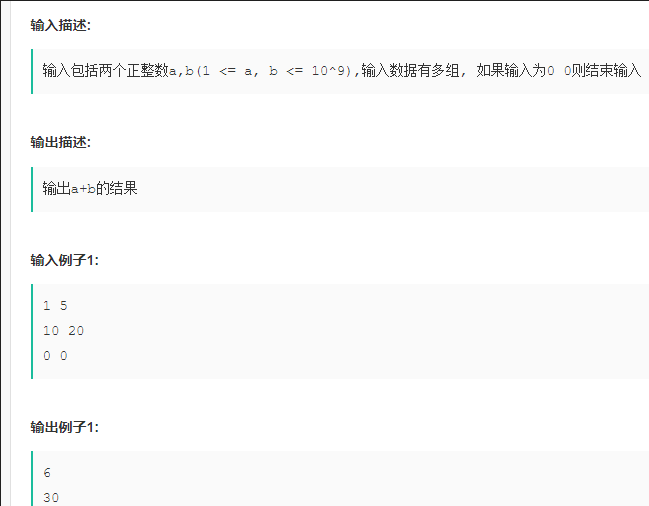

### 牛客acm模式总结
0.开头结尾统一代码
```python
'''
try ：可能抛出异常的语句。
except ：捕获异常，处理异常。
'''
while True:
    try:
        core code
    except:
        break
```
1.单个元素 列输入，列输出

```python
'''
输入 
3
5
6
7
输出
5
6
7
其中第一个3代表着一共有3个数字
需要将他们依次输出

输入实际上就是一个迭代器，每次获取一个元素就用一次input()函数
我们可以首先获得第一个输入的值
然后 for 循环对应的次数，将剩余待输入的元素依次输出
'''
n = int(input()) # 获得第一个输入，n=3
for i in range(n):
    print(int(input()))
```

2. 单个元素 列输入，行输出
```python
'''
输入
3
5
6
7
输出
[5,6,7]
同理，跟第一种情况差不多
获取第一个输入元素，然后for循环对应次数
将剩余的元素添加到一个数组中即可
'''
n = int(input())
res = []
for i in range(n):
    res.append(int(input()))
print(res)
```

3. 单行输入转成字符串列表
```python
'''
输入：3 abc bca cab abc 1
输出：['3', 'abc', 'bca', 'cab', 'abc', '1']
'''
a = list(input().split())
print(a) # ['3', 'abc', 'bca', 'cab', 'abc', '1']
```

4.单行输入转成整数型列表
```python
'''
输入：1 2 3 4 5 6
输出：[1,2,3,4,5,6]
'''
nums = list(map(int(),input().split()))
print(nums)
```

5.单行输入获取每个元素
```python
'''
输入：3 5
需要获取3和5以便后续运算
'''
x, y = map(int(),input().split())
# x = 3     y = 5
```

6.strip()掐头去尾
```python
'''
Python strip() 方法用于移除字符串头尾指定的字符（默认为空格）或字符序列。
注意：该方法只能删除开头或是结尾的字符，不能删除中间部分的字符。

'''
str = "*****this is **string** example....wow!!!*****"
print (str.strip( '*' ))  # 指定字符串 *
# this is **string** example....wow!!!


str = "12123abcrunoob32121"
print (str.strip( '12' ))  # 字符序列为 12
# 3abcrunoob3

str = "   5 4 3 2 1 3 4 5    "
print (str.strip().split()) 
# ['5', '4', '3', '2', '1', '3', '4', '5']
```

7.多行多元素输入，创建二维数组
```python
'''
输入二维数组：
3
1 3 1
1 5 1
4 2 1
（3为数组行数）
输出：
[[1,3,1],
 [1,5,1],
 [4,2,1]]
'''
n = int(input())
arr = []
for _ in range(n):
    arr.append(list(map(int(), input().split())))

```

8.以空格分隔，输出数组元素
```python
'''
输入:[1,2,3,4,1]
输出:1 2 3 4 1
'''
# 方法一
a = input()
print(*a)#1 2 3 4 1
# 方法二
a = input()
for i in range(len(a)):
    print(a[i],end=' ')#1 2 3 4 1 
# 方法二结尾有空格，解决方式是
#   先打印前n-1个，最后一个单独输出
for i in range(len(a)-1):
    print(a[i],end=' ')
print(a[-1])
#1 2 3 4 1
```

9.二维数组以空格分隔输出
```python
'''
输入：[[1,2,5],[6,7,8],[3,9,4]]
输出：[1, 2, 5] [6, 7, 8] [3, 9, 4]
'''
a = input()
print(*a) # [1, 2, 5] [6, 7, 8] [3, 9, 4]
```

10.遇0结束情况
```python
'''
注意，这里无需循环
一行代表一个case
'''
a, b = map(int, input().split())
    if a == 0 and b == 0:
        break
    print(a + b)
```


```python
'''
注意，这里无需循环
一行代表一个case
'''
# 先用一个数组接收
arr = list(int(),input().strip().split())
n, nums = arr[0], arr[1:]
if n == 0:
    break
print(sum(nums))
```
